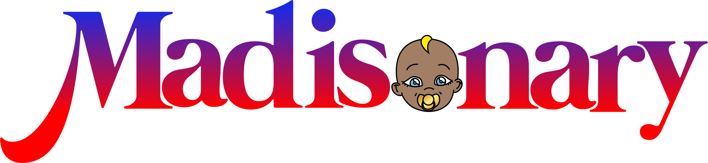

  

# The Madisonary  
### Official Dictionary of the Baby Madison Universe  

---

## Overview  

The Madisonary is an original fictional dictionary developed as part of the Baby Madison universe.  

It introduces a proprietary language system designed to enhance storytelling, emotional expression, and character identity across a multi-platform narrative ecosystem.  

---

## Concept  

The Madisonary establishes a structured linguistic framework composed of:  

- Invented vocabulary  
- Defined meanings  
- Contextual usage  
- Narrative integration  

This system is intended for use across animation, publishing, fashion, and digital media within the broader Jonathanland Universe.  

---

## Intellectual Property Notice  

The Madisonary is an original creation owned by Mason Ewing Corporation.  

This repository and associated documents serve as a public record of authorship and intellectual property.  

This publication contains a partial and non-exhaustive representation of the Madisonary.  
Additional elements remain confidential to preserve proprietary innovation.  

All rights reserved.  

---

## Official Document  

📄 [Download the Madisonary (PDF)](./The_Madisonary_Official_Dictionary_Baby_Madison_v1.1.pdf)

---

## Authors  

- Mason Ewing  
- Corentin Ewing Cormont  

Affiliation: Mason Ewing Corporation (USA)  

---

## DOI Reference  

(Insert Zenodo DOI here after publication)

---

## Contact  

Mason Ewing Corporation  
United States  

---
